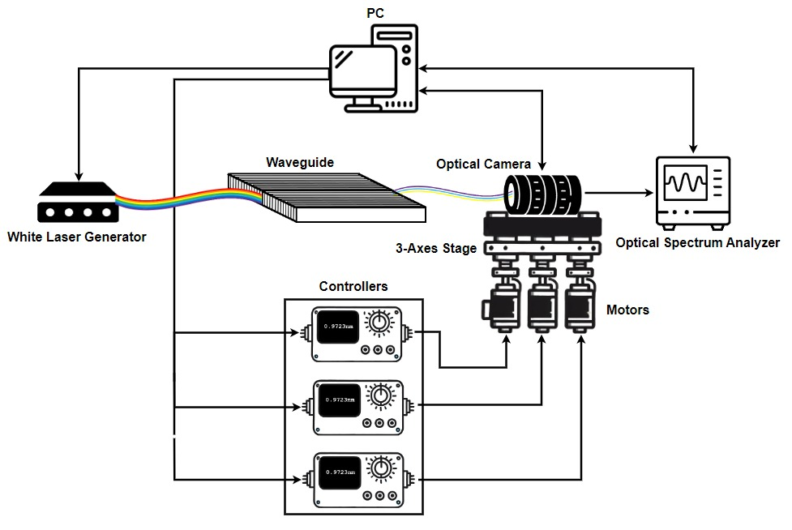
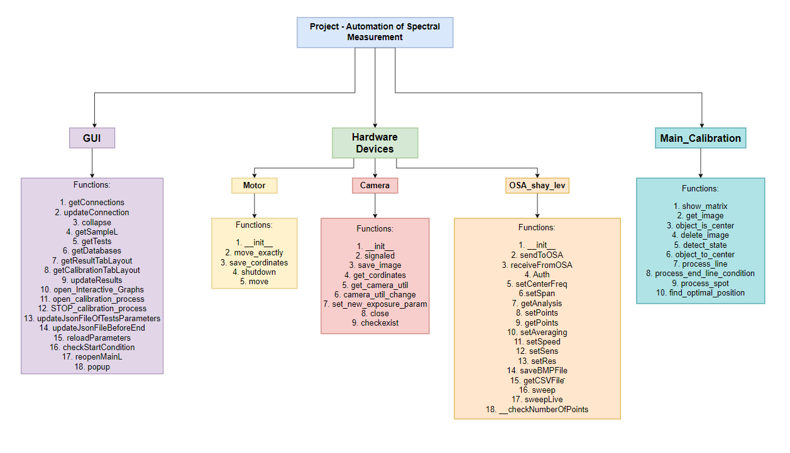

# Automation of Optical System Calibration

BGU B.S.c. Electrical & Computer Engineering - Final Project

This repository contains the code and documentation for automating the calibration of an optical system. The system integrates multiple components, including a laser, waveguide, camera, motors, controllers, and an Optical Spectrum Analyzer (OSA), to automatically align and optimize the laser spot with high precision and power.

## Table of Contents
- [Project Overview](#project-overview)
- [System Components](#system-components)
- [Features](#features)
- [Results](#results)

## Project Overview
The automated calibration system was developed to improve the accuracy and efficiency of aligning an optical system. This project automates the previously manual process of optimizing the laser spot position for maximum intensity. The automated process achieves better accuracy and saves significant time compared to manual calibration.

## System Components
- **Laser**: White Light Laser (WLL), produced by NKT SuperK EXTREME.
- **Camera**: Ninox 640 Model: NX1.7-VS-CL-640.
- **Motor**: Z825B Motorized DC Servo Actuator produced by Thorlabs.
- **Controllers**: K-CUBE KDC101 Brushed DC Servo Motor Controller produced by Thorlabs.
- **Controllers Hub**:KCH601 - USB Controller Hub and Power produced by Thorlabs
- **Optical Spectrum Analyzer (OSA)**: AQ6370D Optical Spectrum Analyzer produced by Yokogawa.
- **Python Code**: Coordinates the components and runs the calibration algorithm including image processing algorithm.
- **Waveguide**

## Features
- Automatic laser spot alignment and optimization.
- Integration with the system controllers, laser, and OSA.
- GUI for controlling and monitoring the calibration process.
- Real-time image analysis and feedback.
- Debug mode for tracking image processing steps.

## Results
- The automation clibration process significantly reduces the calibration time from minimum a day of manual calibration work to approximately 30 minutes of automatic calibration.
- The automated system achieved power levels that demonstrated a level of precision typically associated with hardware calibration rather than manual adjustments.
For comparison purposes, the best power level achieved through manual calibration was approximately -72 [dB]. Our automated system, consistently reached an average power level of -66 [dB], with the peak power reaching an impressive -62 [dB]. These results underscore the effectiveness of the enhanced algorithm in achieving high precision and reliability.

- **Manual Calibration Results:**

- **Automatic Calibration Results:**

